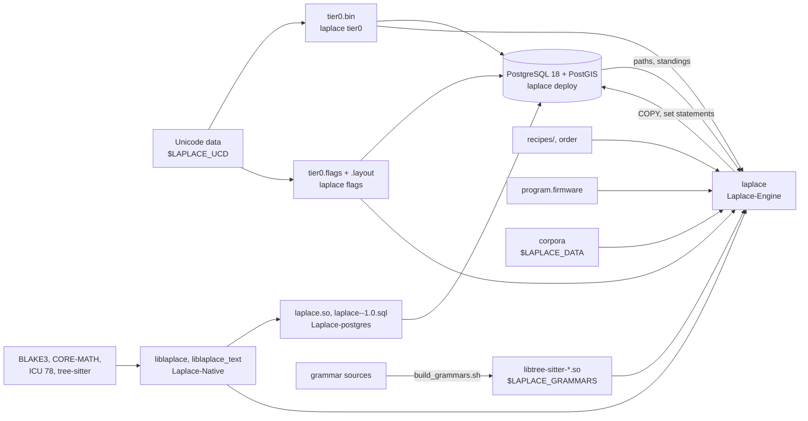

# Repositories

Five repositories implement Laplace: the monorepo SaltyPatron/Laplace is the first full implementation and holds the invention documents; Laplace-Native is the shared library, Laplace-postgres the PostgreSQL extension that links it, and Laplace-Engine the one program that links it and runs the database, the three the wiki calls Laplace itself; and Laplace-Prototype is the test bench the three are checked against.

## What each holds

| Repository | Version | Holds | Builds | Links |
| --- | --- | --- | --- | --- |
| Laplace-Native | 0.2.0 | `include/laplace/laplace.h`, the one public header; `src/`: `cpu.c`, `flags.c`, `utf8.c`, `identity.c`, `coord.c`, `compose.c`, `geometry.c`, `follows.c`, `consensus.c`, `tier0.c`, `geom4d.c`, `pull.c`, `text.c`, `rowsig.c`, `isa/` kernels; `tests/`; `cmake/LaplacePaths.cmake`, `cmake/LaplaceFlags.cmake` | `liblaplace.a` and `liblaplace.so` (everything but text and model); `liblaplace_text` (needs ICU 78); `liblaplace_model` (needs MKL and OpenMP); `lp_crmath` (CORE-MATH `cr_sin`, `cr_cos`); BLAKE3 with its assembly | BLAKE3, libm, pthread |
| Laplace-postgres | 1.0 | `src/laplace_pg.c`; `sql/laplace--1.0.sql` (the install script), `schema.sql`, `semantics.sql`, `lookup.sql`, `indexes.sql`; `laplace.control`; `bench/bench_queries.py` | `laplace.so` into PostgreSQL's `pkglibdir`; the control and SQL files into `sharedir/extension` | Laplace-Native statically, PostgreSQL 18 headers, PostGIS geometry serialization |
| Laplace-Engine | | `src/`: `main.c`, `engine.h`, `recipe.c`, `elements.c`, `members.c`, `records.c`, `table.c`, `file.c`, `vocab.c`, `ingest.c`, `db.c`, `read.c`, `pull.c`, `forward.c`, `fills.c`, `forget.c`, `deploy.c`, `tier0.c`, `flags.c`, `firmware.c`, `bench.c`, `model.c`; `recipes/`; `firmware/program.firmware`; `laplace.env`; `build.sh`; `deploy.sh`; `tools/build_grammars.sh` | `laplace`, one executable | `laplace_text`, `laplace_static`, `lp_crmath`, BLAKE3, the tree-sitter runtime, libpq, OpenMP, zlib, dl; `laplace_model` when MKL is present |
| SaltyPatron/Laplace, the monorepo | engine 0.1.0 | `docs/` (the invention documents and specs), `engine/` (core, synthesis, dynamics, manifests), `extension/laplace_substrate` and `laplace_geom`, `app/` (twelve .NET projects), `web/`, `recipes/`, `seeds/`, `db/migrations`, `scripts/` | `liblaplace_core`, `liblaplace_dynamics`, `liblaplace_synthesis`, `laplace_substrate.so`, `laplace_geom.so`, the application, the web, the perfcaches; see [Monorepo](Monorepo.md) | PostgreSQL 18 and PostGIS at `/opt/laplace/pgsql-18`, tree-sitter, MKL, TBB, .NET 10 |
| Laplace-Prototype | | `tier0/gen_tier0.py`, `ducet_order.py`, `nfd17.py`, `fingerprint.txt`; `dag/ingest.c`; `db/schema.sql`, `indexes.sql`, `load.sh`, `ext/`; `tests/verify.py`, `queries.py`, `gap_query.py`, `breaktest.c`; `chess/`, `semantics/`, `models/`, `code/`, `recipes/` | the golden values the native tests reproduce | ICU 78, BLAKE3, PostgreSQL 18 at port 5439 |

Laplace-postgres and Laplace-Engine build Laplace-Native as part of themselves with `add_subdirectory` and keep no copy of anything in it. The engine and the extension share one implementation of every operation through the header.

The monorepo came first: 1,727 pull requests, a served host, and the documents every Sequence operation cites. The split repositories are the rewrite from the wiki's specification, each a few dozen commits old, and the wiki's [Architecture](../Architecture.md) names them as Laplace. The two implement the invention under different laws, listed in [Monorepo: How it differs](Monorepo.md#how-it-differs-from-the-split-repositories); neither is documented here as the other's successor. The monorepo's documents also name a third repository, Laplace-Refactor, written from the inventor's direct requirements and kept separate; the wiki does not document it.

## The artifact graph

An arrow is a build-time or run-time dependency: the artifact at its tail must exist, at the version the head was built or configured for, before the head can run. Tier 0 and the flags are generated from the Unicode data by the engine and read by both the engine and the extension; the two must map the same file, which [`laplace status`](CLI.md#laplace-status) checks by fingerprint.

## What the prototype is for

The prototype established the golden values: the tier-0 IDs, coordinates, and Hilbert values in `tier0/tier0.bin` and its fingerprint; the decomposition of plain text; the schema; the checks in `tests/verify.py`. Laplace-Native's tests reproduce those values bit for bit, on both compilers. The prototype's schema differs from the built one in two tables, `source` and `entity_stats`, which the built schema does not have; see [Schema](Schema.md#what-the-prototype-had).
