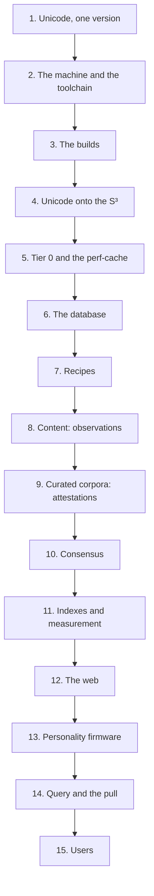

# Sequence

Laplace is built in one order, and each stage is impossible without the one before it: Unicode onto the S³, tier 0, the perf-cache, the store, content, attestations, consensus, the firmware, the pull, and only then a user.

This page is the whole chain, written out, from the Unicode data to a user's first prompt. Each stage says what it takes in, what it does, what it leaves behind, and what stops if it is missing. The specification pages are the authority; this page repeats them in order so that the order itself is recorded, and links to each page at the point where it applies.



## 1. Unicode, one version

All digital content boils down to Unicode codepoints, so the first thing Laplace fixes is which Unicode. Everything after this stage is computed from these files, and two installs agree only if they started from the same ones.

### The files

Tier 0 is built from the Unicode data, in full:

- the UCD XML, flat or grouped, which carries `UnicodeData`, `Scripts`, and the other UCD files;
- `allkeys.txt` from the UCA, for sequencing;
- the bidi, CJK, and emoji data;
- the ISO and other flags that go with them.

The flat XML covers the whole codespace in one file. UAX #42 divides codepoints into four element types, `char`, `reserved`, `surrogate`, and `noncharacter`, each carrying its properties as attributes, with at most one element per codepoint. In the Unicode 17.0.0 file: 159,869 `char` elements covering 297,334 codepoints, 789 `reserved` elements covering 814,664, 3 `surrogate` elements covering 2,048, and 18 `noncharacter` elements covering 66. That is 1,114,112 codepoints, none uncovered, no overlaps. Reserved, surrogate, and noncharacter ranges carry the full non-Unihan attribute set with default values, so per-codepoint metadata for the entire codespace comes from this one file.

`allkeys.txt` is the Default Unicode Collation Element Table. In the 17.0.0 file: 39,749 entries, 38,785 of them single-codepoint, 964 contractions, 3,998 single entries expanding to more than one element, 8,496 single entries whose first element is variable, and 6 `@implicitweights` lines. Every codepoint not listed gets implicit weights by the formula in UTS #10 §10.1.

### The version

Tier 0 and segmentation always use the same Unicode version. A new version is adopted only when its data and its segmentation tooling are both final. Segmentation is ICU's, and ICU must carry the same Unicode version as the data: ICU 70.1, on Unicode 14 rules, passed 756 of 766 grapheme tests, 1,940 of 1,944 word tests, and 512 of 512 sentence tests against the Unicode 17 files; ICU 78.3, on Unicode 17 rules, passed all of them. The failures were rules added after Unicode 14, such as Indic conjunct clusters and emoji ZWJ sequences.

What stays fixed across versions, by the Unicode stability policy: once a character is encoded it is never moved or removed; names never change; normalization output is identical across versions for text assigned in both; decomposition mappings and canonical combining classes never change once assigned. What can change: collation weights, segmentation rules and properties, script, line break, case mappings, and emoji properties. The codepoint is the one fully stable identifier, which is why an ID is derived from the codepoint and never from a weight or a rank.

### What this stage leaves behind

- The codespace: all 1,114,112 codepoints, U+0000 to U+10FFFF, including unassigned, private-use, surrogate, and noncharacter codepoints. The scope is never reduced to the codepoints in use.
- The data that gives every codepoint its properties, its collation elements, and its segmentation classes.
- One version number that every later fingerprint depends on.

Without it there is no codespace to place, no order to place it in, and no segmentation to break content with.

Specified in [Atoms: The codespace](Storage/Atoms.md#the-codespace), [Atoms: Unicode data](Storage/Atoms.md#unicode-data), [Atoms: Unicode versions](Storage/Atoms.md#unicode-versions), and [Compositions: Segmentation](Storage/Compositions.md#segmentation). The data is measured in [Research: Unicode](Research/Unicode.md).

## 2. The machine and the toolchain

Laplace is native C, with SQL and C# as orchestration. Every operation goes into native C. SIMD, AVX, VNNI, and the like are heavily preferred. Bit-perfect determinism across hardware and operating systems requires a specific build configuration, and every build has a fingerprint. This stage fixes the machine and the toolchain that every later stage is compiled and measured with.

### Hardware

- **CPU:** x86-64-v2 at minimum. Every Laplace kernel is compiled for each ISA level and chosen at run time: x86-64-v3 with AVX2, FMA, and BMI2; AVX-VNNI; x86-64-v4 with AVX-512; AVX-512 VNNI. A CPU without a level runs the next level down, with the same results.
- **GPU:** Laplace never requires one. Third-party tools that produce input for Laplace, such as a neural dependency parser used as a witness, may use one.
- **Memory:** enough for PostgreSQL's shared buffers, about a quarter of RAM, on huge pages, plus the operating system's page cache.

### Storage

| Data | Put it on | Why |
| --- | --- | --- |
| PostgreSQL heap and indexes | the fastest drive, NVMe | random reads for index lookups |
| Write-ahead log | a separate SSD | sequential writes that do not compete with reads |
| PostgreSQL temporary files | a separate SSD, as a tablespace | sorts and index builds that spill |
| Repositories and build trees | an SSD | |
| Datasets and archives | any bulk storage | read once, at ingestion |

### Repositories and dependencies

All repositories, Laplace's and its dependencies' alike, live under one source root, such as `/repos/src`, with build trees kept outside it, such as `/repos/build` and `/repos/work`. Laplace's own repositories are Laplace-Native, Laplace-postgres, Laplace-Engine, Laplace-Prototype, and Laplace-Wiki. The dependencies are cloned and built from source, every one of them with Intel oneAPI's `icx`, with the compiler flags, arguments, and math libraries that give the same bits across hardware, operating systems, and linkers: PostgreSQL, PostGIS, GEOS, PROJ, GDAL, BLAKE3, CORE-MATH, Eigen 3.4, Spectra, hnswlib, tree-sitter, and ICU.

### Toolchain

| Tool | Requirement | Use |
| --- | --- | --- |
| Intel oneAPI: `icx`, `icpx`, MKL, TBB, IPP | 2025 or newer | the primary compilers and libraries |
| gcc | any current | a second compiler, to check that results do not depend on the compiler |
| CMake | 3.24 or newer; 4.x for `icx` 2026 | Laplace builds |
| Meson and Ninja | Meson 0.61 or newer | PostgreSQL's own build system |
| ICU | 78 or newer | Unicode 17 segmentation |
| PostgreSQL | 18 | with liburing, LZ4, zstd, ICU, and OpenSSL |
| PostGIS | 3.6 | |
| liburing | 2.1 or newer | optional |

Thread counts come from the environment: `OMP_NUM_THREADS` and `MKL_NUM_THREADS` set how many cores MKL and OpenMP kernels use. Some shells and agents set them to 1, which makes every kernel single-threaded; the same kernel run over one vocabulary took 110.8 s on one thread and 19.9 s on twelve. An environment file sources oneAPI and points the builds at Eigen, Spectra, BLAKE3, and the custom PostgreSQL. Anything that needs root is written as a script that logs its output.

### Determinism

Bit-for-bit identical results across hardware and operating systems require:

| Setting | Why |
| --- | --- |
| Strict IEEE-754 semantics | every operation rounds exactly as specified |
| No fast-math | no reassociation, reciprocal approximation, or flushing |
| No FP contraction (`-ffp-contract=off`) | `a*b + c` is not silently fused into one rounding |
| SSE2 floating point | binary64 throughout, no x87 80-bit intermediates |
| Correctly rounded libm | `sin`, `cos`, and `sqrt` give the same bits everywhere |

libm `sin` and `cos` are not required to be correctly rounded, and glibc, musl, MSVC, and CUDA differ in the last bits, so the same codepoint could get different points on different machines. CORE-MATH provides correctly rounded functions, which is why it is a dependency.

### What this stage leaves behind

One machine, one source root, one environment file, and one toolchain that every Laplace build and every dependency is compiled with. Without it nothing compiles, and anything that compiles elsewhere does not agree bit for bit, so no two installs could share a fingerprint.

Specified in [Setup](Operations/Setup.md) and [Architecture: Native C](Architecture.md#native-c). The determinism settings are in [Research: Numerics](Research/Numerics.md#deterministic-builds).

## 3. The builds

PostgreSQL, Laplace-Native, and Laplace-postgres are built from source with Intel's compilers, with floating-point settings that give the same bits on every CPU. The builds go in this order because each links the one before it.

### PostgreSQL

PostgreSQL is built with `icx` so that the server and the extensions share one compiler, into its own prefix such as `/usr/local/pgsql`, with ICU, OpenSSL, LZ4, zstd, and liburing. The contrib modules include `pg_stat_statements`, `auto_explain`, and `pg_buffercache`, which Laplace uses for observability. Extensions built with PGXS take their flags from the compiler PostgreSQL was built with, so a gcc-built server hands `icx` flags it rejects: one reason to build the server with `icx` too.

### Laplace-Native

The library with the shared code, built twice, once with each compiler.

- **Outputs:** `liblaplace`, static and shared; `laplace-bench`, which measures every operation with each SIMD kernel beside its scalar form; `laplace-ingest`, which needs ICU and libpq.
- **Determinism:** `icx` defaults to fast floating-point math, and its `-fp-model=precise` still fuses multiplies and adds into FMAs, which round once where two operations round twice. The build turns fusing off and never uses fast math. Every summation has one fixed order in every code path, so scalar and SIMD kernels agree bit for bit. IDs and coordinates are exact integers or fixed point.
- **ISA levels:** the baseline is x86-64-v2. Kernels are compiled per ISA level in their own translation units and chosen at run time, so one binary runs everywhere and uses everything.
- **Model tools:** the model kernels need MKL and OpenMP and build only when the oneAPI environment is set. The core library and the extension do not depend on them.
- **The two compilers:** the `icx` and `gcc` builds must agree on every golden value, such as the tier-0 IDs and Hilbert values, bit for bit. Both compilers reproduced the prototype's tier-0 IDs and Hilbert values bit for bit.
- **BLAKE3:** its CMake recognizes gcc, clang, and MSVC but not `icx`, so Laplace-Native supplies BLAKE3's assembly sources itself.

### Laplace-postgres

The expansion of PostgreSQL to 4D, with real math from Laplace-Native. PostGIS functions such as `ST_Centroid` give 2D or 3D results, not 4D, so Laplace-postgres expands PostgreSQL to 4D throughout. Those 4D capabilities are expansions of GIS, not replacements: Laplace uses the standard geometry types, such as a normal POINT ZM, and adds 4D functions alongside what PostGIS already provides, rather than stepping on more than 40 years of battle-testing. CMake reads only the paths from `pg_config` and links Laplace-Native in statically. It installs into PostgreSQL's library and extension directories. Changing the extension uses versioned upgrade scripts, never a drop: dropping the extension drops every index built on its functions, such as the GIN container index.

### Laplace-Engine

Laplace itself, built against Laplace-Native, working against a database extended by Laplace-postgres.

### What this stage leaves behind

The server, the library, the extension, and the engine, each with a fingerprint, and the proof that two compilers give the same golden values. Without it there is no generator for tier 0, no 4D functions in the database, no ingestion, and no engine.

Specified in [Builds](Operations/Builds.md) and [Architecture: Repositories](Architecture.md#repositories). The measured native rates of these builds are in [Research: Engine Measurements](Research/Engine.md#native-operations).

## 4. Unicode onto the S³

Laplace places everything in a 4-ball inside a 4-cube, with Unicode projected across the 4-ball's surface, the S³, and compositions forming inside it. This stage is the projection: every codepoint gets its point on the surface. Nothing above tier 0 has a coordinate until this exists, because every composition's coordinate is computed up from the codepoint leaves.

### The space

- The **4-ball**, B⁴, is the solid ball in four dimensions: every point within distance 1 of the origin.
- Its surface is the **3-sphere**, S³, also called the glome: every point at distance exactly 1.
- The **4-cube**, [−1, 1]⁴, is the box around the 4-ball.

The part of the 4-cube outside the 4-ball is forbidden space. The codepoints are projected to the surface of the S³ as perfectly as possible, and that Unicode perimeter acts as a barrier, a cosmic wall: the math proves that nothing can ever fall outside it, and that only repeats of a single codepoint, such as `[n,n,n,n,n]`, sit exactly on the surface.

### Step 1: the order

The codepoints are sequenced by DUCET. One deterministic order of all 1,114,112 codepoints is derived in three steps:

1. **Collation elements.** Take the explicit `allkeys.txt` entry, the Hangul jamo through NFD, or the implicit pair, with non-ignorable variable weighting: `*` weights are used as-is. Every codepoint not listed gets two collation elements by class: Tangut, Nushu, and Khitan get fixed leads; Core Han gets `FB40 + (CP >> 15)`; Other Han gets `FB80 + (CP >> 15)`; everything else, unassigned, private use, noncharacters, and surrogates, gets `FBC0 + (CP >> 15)`, each with `(CP & 7FFF) | 8000` as the second element. A supplement block shares its base with the main block and counts from the main block's start; the prototype had exactly that bug until the collation conformance test exposed it.
2. **Sort key.** Form the UCA sort key L1 | L2 | L3 from the non-zero weights.
3. **Ties.** Break ties first by the identical level, the codepoint's canonical decomposition, then by codepoint. The identical level alone is not enough for single codepoints, because canonical singletons such as U+212B and U+00C5 still tie. Skipping it misorders pairs such as U+2001 EM QUAD against U+2002 EN SPACE.

Before step 3 there are 1,419 tie groups covering 6,324 codepoints. After it, every codepoint has one rank: U+0000 is rank 0; the first non-ignorable codepoint is at rank 1,640; U+0020 at 1,648; `a` at 12,142; `A` at 12,159; U+AC00 at 25,261; U+4E00 at 56,415; U+10FFFF at 1,114,110; and the last codepoint is U+FFFD, whose fixed primary sorts above all implicit weights. The SHA-256 of the order, written as 3-byte big-endian codepoints, is `31548536a65d75e4f4e3f866d4bb5315ddbfe803edb7d0a018eebfb5c89257e0`. The order is pinned to the Unicode version, and IDs are never derived from weights or ranks.

### Step 2: the points

Codepoints are placed across the S³ at Marc Alexa's Super-Fibonacci points, which relate to the Hopf fibration and distribute evenly across the S³. One set with n = 1,114,112, fixed once:

```text
for i in 0 .. n-1:
    s = i + 1/2
    t = s / n
    r = sqrt(t),  R = sqrt(1 - t)
    alpha = 2*pi*s / phi,  beta = 2*pi*s / psi
    q[i] = (r sin alpha, r cos alpha, R sin beta, R cos beta)
```

with φ = √2 and ψ the positive real root of ψ⁴ = ψ + 4, ψ = 1.533751168755204288118041…. Every coordinate depends on t = (i + ½)/n, so n is fixed in advance: point *i* of the *n*-point set is not point *i* of any other set. With n fixed at the size of the codespace, every point is permanent. Measured over the full set: minimum nearest-neighbor distance 0.012734, mean 0.019937, all norms equal 1 to within 2.2 × 10⁻¹⁶. For comparison, that many independent random points would have a minimum nearest-neighbor distance about 60 times smaller.

The spiral index carries no spatial locality: each step from index *i* to *i* + 1 turns α by about 254.6° and β by about 234.7°, so consecutive indices land on nearly opposite sides of both circles, a median 1.686 apart, farther than two random points. That is what makes the set well spread, and it is why rank cannot map to spiral index directly.

### Step 3: Hilbert order

The points are taken in the order of their Hilbert value: the actual Hilbert value from the 4-cube [−1, 1]⁴, filtered to the S³. Each axis is quantized to 16 bits and the value is computed with Skilling's transpose algorithm, in O(n·p) time with no tables. A Hilbert curve is a space-filling curve: points that are close along the curve are close in space. Sorting the Super-Fibonacci points by Hilbert value replaces the spiral's visiting order with the curve's, so consecutive positions in the sorted list are spatial neighbors, while the points themselves remain the evenly spread Super-Fibonacci set.

### Step 4: rank to point

DUCET rank *r* takes the *r*-th point of that walk. Collation neighbors are therefore spatial neighbors: `King` falls by `king`, by `ding`, by `dong`, by `kong`. Measured: the median distance between consecutive DUCET ranks is 0.026 under this placement, against 1.686 under the plain spiral index. Case, width, and style variants of one letter are consecutive ranks, so `a`, `ａ`, `𝐚`, `ⓐ`, and `A` are consecutive points along the curve; the mean pairwise distance within `A a ä á à â å ã ā` is 0.086. Word centroids inherit it: `king` to `ring` 0.049, to `sing` 0.049, to `kong` 0.079, to `cat` 0.238, to `猫` 0.651.

The placement is not exact, but it is predictable and recordable. Rank and point are both fixed by the Unicode version, and IDs are not derived from either. Between Unicode versions only the points move; the IDs do not.

### The interior

Compositions form within the 4-ball, inside the Unicode perimeter. Tiers layer and form bands. The more complex the tier, the deeper toward the center it sits on average, and the math requires that: a composition's real coordinate is the average of its constituents' coordinates, so by the triangle inequality every composition is at least as deep as the average depth of its own constituents. The two are equal only when every constituent is the same point. How deep a composition sits measures how concentrated its constituents are: the length of the average of points on the S³ is their mean resultant length, 1 when they are all identical and approaching 0 as they spread evenly over the whole S³.

### What this stage leaves behind

One point on the S³ for every codepoint, the same on every install that started from the same Unicode version, and the wall around everything that will ever be composed. Without it there is no surface, no wall, and no place for a composition to fall inward from.

Specified in [Space](Storage/Space.md) and [Atoms: Placement](Storage/Atoms.md#placement). The order is measured in [Research: Unicode](Research/Unicode.md#the-deterministic-total-order), the points in [Research: Sampling](Research/Sampling.md), and the placement in [Research: Placement](Research/Placement.md).

## 5. Tier 0 and the perf-cache

Codepoints are tier 0, the absolute floor: every Unicode codepoint has a deterministic ID and a deterministic coordinate on the S³. This stage writes them down, once, in the form every later stage reads.

### The ID

BLAKE3 is simply a unique identifier. It gives enough bits to avoid collisions. A codepoint's ID is the BLAKE3 hash of its UTF-8 bytes. UTF-8 handles every Unicode scalar value; surrogates are a UTF-16 mechanism and never appear alone in valid text, so they take UTF-8's generalized 3-byte form, which no valid character uses. The ID is the first 16 bytes of the standard 256-bit hash: BLAKE3 is an extendable-output function whose shorter outputs are prefixes of longer ones, so the 128-bit ID is exactly `digest(32)[:16]`. Every one of the 1,114,112 IDs is unique.

At 128 bits the probability of any accidental collision among n nodes is 1 − exp(−n(n−1) / 2¹²⁹): 1.47 × 10⁻²¹ at 10⁹ nodes, 1.47 × 10⁻¹⁵ at 10¹², 1.47 × 10⁻⁹ at 10¹⁵. Generic collision work is about 2⁶⁴ hash evaluations; preimage and second preimage about 2¹²⁸.

### The coordinate

The point from stage 4 is stored as a fixed-point coordinate: every coordinate is *m* · 2⁻⁵³ with integer |*m*| ≤ 2⁵³. Such values are exact doubles, so the columns stay `float8`, while the arithmetic on them is integer arithmetic. The rounding of the generated points left half of them a few ulp outside the S³ in exact arithmetic, by at most 4.4 × 10⁻¹⁶, and none exactly on it. The fix: truncate toward zero, then decrement the largest |*m*| while Σ*m*² > 2¹⁰⁶; that test is exact in 128-bit integers. Over the codespace it took 0 steps for 556,849 points, 1 for 501,210, 2 for 55,477, 3 for 574, and 4 for 2, and 624,971 ulp steps in total. After the fix every point satisfies *m*·*m* ≤ 2¹⁰⁶ exactly. This is what makes the wall a theorem about the stored numbers and not only about the real ones: a composition's coordinate is `trunc((Σ m_j) / k)` in integer arithmetic, the exact centroid of points of norm at most 1 has norm at most 1 by convexity, and rounding toward zero never increases a norm. For a pure repeat, Σ = k·p exactly, so `[n,n,…,n]` lands bit for bit on n's point.

### The Hilbert value

Every codepoint also records its Hilbert value, from stage 4. The Hilbert value is also for locality, partitioning, and ordering, to optimize performance and reduce random thrashing. Compositions have a Hilbert value too, derived from the coordinate and never part of an ID.

### The record and the file

The prototype's tier 0 is all 1,114,112 codepoints, each a 64-byte record: BLAKE3-128 ID, fixed-point coordinate, Hilbert value, DUCET rank. The whole table is 68 MiB. Tier 0 is generated native C that is marshalled into PostgreSQL. It is memory-mapped as a perf-cache, so the client can look up any codepoint in O(1), in microseconds. Tier 0 is still recorded to the database, but function calls never need to read it from there. That eliminates at least half of the database calls and round trips. The perf-cache is modular: ASCII, UTF, CJK, emoji, and so on, and the same applies to other modalities, such as 8-bit, 16-bit, and 32-bit color for images. That enables deployment to lesser hardware; the full tier 0 is small enough for a Raspberry Pi.

### The fingerprint

Every build has a checksum, a fingerprint, so an install knows which tier 0 it has. Two installs with the same fingerprint produce the same coordinates for the same content, so they sync perfectly. The prototype's fingerprint, the SHA-256 of its table, is `1710d2d9899ce403c73513642250b80a0827cf77819fbd79a8ae93c5aae482a5`; both `icx` and `gcc` builds of Laplace-Native reproduce its IDs and Hilbert values bit for bit.

### What this stage leaves behind

The ID, coordinate, Hilbert value, and flags of every codepoint, in one fingerprinted file that the client and every database backend map. Without it nothing above tier 0 can have an ID or a coordinate, because every composition's ID is hashed from its constituents' IDs and every coordinate is computed up from the codepoint leaves. The client can compute nothing, and every lookup would need a database round trip.

Specified in [Atoms: Generation](Storage/Atoms.md#generation), [Identity: BLAKE3](Storage/Identity.md#blake3), and [Identity: Client-side computation](Storage/Identity.md#client-side-computation). Measured in [Research: Hashing](Research/Hashing.md), [Research: Numerics](Research/Numerics.md#the-fixed-point-grid), and [Research: Prototype](Research/Prototype.md#tier-0).

## 6. The database

PostgreSQL's defaults suit small general-purpose servers; Laplace tunes memory, I/O, and planning to its hardware and to the way it uses geometry and indexes. Then a Laplace database goes from empty to loaded in five steps: extensions, schema, ingestion, indexes, and measurement. This stage is the server and the first two steps. Ingestion is stages 7 to 10 and the indexes and measurement are stage 11.

### The server

Settings are made with `ALTER SYSTEM`; those marked *restart* take effect when the server restarts. The values are the reference machine's: 125 GB of RAM, 12 threads, an NVMe heap.

| Setting | Rule | Example |
| --- | --- | --- |
| `shared_buffers` | about a quarter of RAM, sized to fit the reserved huge pages; *restart* | 31 GB on 16,744 huge pages of 2 MB |
| `huge_pages` | `try`, then check `huge_pages_status` is `on` | |
| `effective_cache_size` | the memory the page cache can use | 88 GB |
| `work_mem` | generous: Laplace runs few, heavy sessions | 256 MB |
| `maintenance_work_mem` | large: GIN index builds use it all | 8 GB |
| `io_method` | `worker`, unless `io_uring` passes a cold-read stress test; *restart* | `worker` |
| `io_workers` | about two thirds of the cores | 8 |
| `effective_io_concurrency`, `maintenance_io_concurrency` | high on SSDs | 256 |
| `random_page_cost` | 1.1 on SSDs | |
| `default_toast_compression` | `lz4`: long paths are compressed and decompressed often | |
| `max_wal_size` / `min_wal_size` | large, so bulk loads do not force checkpoints | 32 GB / 4 GB |
| `wal_buffers` | *restart* | 64 MB |
| `wal_compression` | `zstd` | |
| `checkpoint_timeout` | 30 min | |
| `shared_preload_libraries` | `pg_stat_statements, auto_explain`, unquoted; *restart* | |
| `track_io_timing`, `track_wal_io_timing` | on | |

On Linux 5.15, `io_uring` failed 1 of 12 cold parallel index builds with "could not read blocks: Operation canceled", while `worker` failed none and ran 5–10% faster. Bulk ingestion sessions set `synchronous_commit = off`.

### Planning

PostgreSQL and PostGIS assume that a geometry's coordinates are positions and that a function in an index is cheap. A Laplace path's coordinates are packed IDs, and its index key decodes a whole trajectory, so the defaults misjudge both:

| Setting | Value | Why |
| --- | --- | --- |
| Cost of the function that decodes a path's IDs | 10,000 | At lower costs the planner scans the partition of whole books and decodes every one on every lookup: 90 ms of a 111 ms query. |
| Statistics on the path column | 0 | Histograms of packed IDs mean nothing: `ANALYZE` took 332 s with them and 2.5 s without. |
| `enable_parallel_append` | off | Starting parallel workers takes about 15 ms; a container lookup takes 1 ms. |
| `parallel_workers` on physicality partitions | 0 | the same |
| `jit` | off | Compiling a short lookup costs more than it saves. |
| `max_parallel_maintenance_workers` | about half the cores | Index builds, including GIN, run in parallel. |

### Step 1: role, database, and extensions

A role that may create databases and extensions, the Laplace database, and the extensions: PostGIS, Laplace, `pg_stat_statements`, and `pg_buffercache`. The extension's setting points to the tier-0 perf-cache from stage 5, and each backend memory-maps it on first use. The perf-cache is thereby available inside the database as native functions, so queries can compute IDs and coordinates in place instead of scanning tables; such a function is evaluated once when the query is planned, and the query becomes an index lookup on the result.

### Step 2: the schema

Every entity is its own record, with its ID and its real coordinate. Every entity also has a physicality, related to it by foreign key. The Laplace content database holds entities, physicalities, and sources; its few text columns, such as a source's origin, use UTF-8 with a deterministic, operating-system-independent collation. Operational data such as logs, authentication, and billing stays conventional, in a separate database.

Entities, paths, and statistics are list-partitioned by tier. The largest tiers are split again into 16 partitions by the first hex digit of their ID. Partitions go by the ID hash, not by Hilbert value: remember the 4-ball against the 4-box. Measured, Hilbert ranges failed: with word segments and sentences each split into 8 equal Hilbert ranges of the 4-cube, all 765,412 word segments and all 1,678,740 sentences landed in the first range, because English text lies in one small region of the 4-ball and Hilbert ranges divide the 4-cube around it. ID prefixes worked: split by the first hex digit, the word segments fell 47,628 to 47,964 per partition. An ID is a hash, so any content divides evenly, and a lookup by ID prunes to one partition. The schema also applies the planning settings above.

### What this stage leaves behind

A tuned server, a database that knows its tier 0, and the tables to record an entity and its physicality. Without it there is nowhere to record a composition, the database cannot compute an ID in place, and no index has a table to sit on.

Specified in [Database](Operations/Database.md), [Deployment](Operations/Deployment.md), [Architecture: Databases](Architecture.md#databases), [Physicality: Entity and physicality](Storage/Physicality.md#entity-and-physicality), [Physicality: Partitions](Storage/Physicality.md#partitions), and [Query: Functions in queries](Query.md#functions-in-queries). The partition measurements are in [Research: Engine Measurements](Research/Engine.md#partitions).

## 7. Recipes

Literally any standardized or fixed-format file is a modality to Laplace, and Laplace treats them all exactly the same: a generic decomposer uses a recipe to tell it how to extract the content. Before a file of any format can be ingested, its recipe exists. Plain text's recipe is UAX #29.

### What a recipe says

The decomposer and the ingestion pipeline are optimized to the limit and powered by recipes that denote how to decompose content into Laplace records: how content is recorded, what content is recorded, what gets reproducibility, and what does not matter. Encrypted content has no value to Laplace: it is random binary blob storage.

A file has a trunk, with children for the file's metadata and for the file's content: EXIF data, headers, and so on. Every standardized file, such as `something.txt`, `audio.mp3`, or `image.bmp`, branches into its own trees. Laplace applies the same kind of breakdown to every modality. For an image:

```text
codepoint → digit → number → intensity → channel → pixel → patch → region → image
```

Numbers are compositions of codepoints: `[2,5,5]` is a pixel channel intensity, a raw byte value, an IP segment, and more. It only gets a type when it is put into a Merkle DAG composition. Repeats are not recorded one by one: an all-white image does not record a billion white pixels; the white pixel is one entity, and repeats are run-length encoded.

### Text

UAX #29 breaks text down from its meaningful codepoints, using Unicode's character properties rather than any one language's rules. Extended grapheme clusters, words, and sentences each have their rules and their driving properties. Segments are lossless: a boundary is an offset in the text, the rules break at the start and end of any non-empty text, and segments are the spans between consecutive boundaries, so they tile the string exactly. Whitespace, punctuation, and controls are never dropped. Scripts written without spaces between words, such as Thai or Chinese, need tailoring, and ICU implements dictionary-based breaking for Thai, Lao, Khmer, Myanmar, and CJK. For text content the basic structure is codepoint ↔ grapheme ↔ word ↔ sentence ↔ document ↔ file, with paragraphs, titles, and the various separators besides.

### Other formats

A recipe first needs the format's structure: fields, chunks, repeats, and choices. Kaitai Struct describes binary formats declaratively, with 189 specifications including BMP, PNG, GIF, JPEG, EXIF, WAV, ZIP, and ELF. Tree-sitter grammars describe code and markup: every node records its byte range, and whitespace is the gap between tokens, so the tokens plus the stored gaps rebuild a source file exactly. Compressed payloads are the hard part: stored compressed they never deduplicate, stored decoded the exact file is lost. Published tools decode to meaningful content and keep a small record that reproduces the original bytes, such as preflate for deflate and Lepton for JPEG. A prototype PNG recipe decomposed 26 files into a metadata tree and a content tree with real Laplace IDs, and recomposed all 26 byte for byte. Tree-sitter's C and Python grammars decomposed 5,976 source files of PostgreSQL and CPython into content-addressed subtrees and recomposed all 5,976 byte for byte.

### What this stage leaves behind

For each format, the decomposition of a file into a Merkle DAG and its recomposition byte for byte. Without a recipe, a file of that format is a random binary blob, and nothing in it is content.

Specified in [Ingestion: Recipes](Storage/Ingestion.md#recipes), [Compositions: Files](Storage/Compositions.md#files), [Compositions: Repeats](Storage/Compositions.md#repeats), [Compositions: Types](Storage/Compositions.md#types), and [Compositions: Segmentation](Storage/Compositions.md#segmentation). Measured in [Research: Recipes](Research/Recipes.md) and [Research: Unicode](Research/Unicode.md#text-segmentation-uax-29).

## 8. Content: observations

Ingestion computes content's IDs on the client and deduplicates it trunk to leaf against what is already recorded. This stage is the first content in the store, and everything it records is observation: what the content is and how it lies, with no one yet saying anything about it.

### Client-side

The client breaks content down and computes its IDs and coordinates itself, using the memory-mapped tier 0 from stage 5. With tier 0 memory-mapped, the client deterministically produces the ID and coordinates of any content without a database call.

### The composition

A composition is an n-ary, recursive sequence of constituents, each of which is a codepoint or another composition. Its constituents can be atoms, other compositions, or both. Nothing is dropped: whitespace and punctuation are constituents like everything else. "The cat sat on the mat" is a sentence composed of words and codepoints, `[The, ' ', cat, ' ', sat, ' ', on, ' ', the, ' ', mat]`; "Sherlock Holmes" is `[[S,h,e,r,l,o,c,k], ' ', [H,o,l,m,e,s]]`.

Codepoints are tier 0. Graphemes are tier 1, words tier 2, and so on. The tier of a composition is always at least one more than the tier of its highest constituent, so the DAG is acyclic by construction. A node can fill a higher tier, but never a lower one: `[H,e,l,l,o]` is always a tier 2 word, and "Hello" on its own is never really a separate tier 3 sentence, while "Hello!" is.

### The ID

Every node's ID is the BLAKE3 hash of its constituents, so the same content always has the same ID. A composition's ID is BLAKE3 over its children's 16-byte IDs, repeats included, truncated to 16 bytes. A composition with one child is that child. Every child ID has the same fixed width, so the input parses in exactly one way and the byte length fixes the child count: `[a,a]` is twice as long as `[a]`, `[2,5,5]` and `[2,5]` are different inputs and different IDs, and there is no padding, sorting, or removal of repeats before hashing. Run-length encoding lives in the path's metadata, never in the hash input.

The hash is purely content. Type, tier, source, position within the source, index, and so on are not the content; they are the observation and position of that content, and they are never part of the ID. Hashes are never faked. Text is recorded as it arrives, without normalization: precomposed and decomposed forms are different content, and the form a source arrived in is recorded as a filter. Case is never folded: `King` is not `king`. The hash covers structure: `[ab,c]` and `[a,bc]` both spell "abc" and have different IDs, so segmentation must be a deterministic function of local content, which stage 7 guarantees.

### The coordinate and the path

Every composition has a full, real 4D coordinate, recorded on its entity as a normal POINT ZM: the exact integer average of its children's coordinates, truncated toward zero, so it falls inward and never outside the wall. Compositions have a Hilbert value too.

Every entity also has a physicality: the path recorded with geometry ZM, which can be a point, a line, a polygon, a multi-line, and more. Each vertex is the ID of a constituent entity, in order; M carries that vertex's metadata, a fixed-length binary field of bits for flags, values, segmentation, and anything else, such as run-length encoding. An atom's physicality is a POINT ZM holding its own ID. The 128-bit ID is bit-packed into the mantissa bits of the X, Y, and Z coordinates of the vertex: 43, 43, and 42 bits, with a fixed exponent that keeps these coordinates between 0.25 and 0.5, inside the 4-ball. The hash does not need more than three of the four mantissas, and the 28 spare bits are dynamic, tagged by a small layout tag. These packed coordinates have no meaning as positions; they are an artist's rendition, and their bits are what record which constituents, in which order. The same entity ID is placed into every path that uses it: that is what lets `[2,5,5]` be text, a number, an IP segment, and more. Bit-packing is what makes the database searchable by ID, and it enables a 3D visualization of the 4D representation. A centroid is recorded for both the real coordinates and the packed visualization, so it is never recomputed.

The physical trajectory records the order of the constituents, so no ordinal is needed. The trajectory alone gives precedes, contains, co-occurrence, and more. Referencing a trunk node is enough to reach everything under it: from the trunk, the geometry fans out to its constituents and hops along them, down to the atoms.

### Deduplication

Deduplication is an O(tier) check from trunk to leaf. Everything it finds already recorded is eliminated, so the check reduces its own total count as it goes. The checks are set-based operations, not per-row conflict handling. Same content means the same hash: if a trunk node matches, its children match as well; if they do not, the ingestion was done wrong. Pruning on a trunk match is sound because a node is recorded only when everything under it is recorded; recording bottom up, leaves first, in one transaction maintains it. Because IDs are deterministic, ingesting the same Merkle DAG again lands on the same nodes: it is the same content, so it overlaps.

Measured on the real implementation: 195 Gutenberg texts, 209 MB, went into the database by binary COPY in 60 s; decompose, hash, deduplicate, and recompose took 26.6 s on one thread with 195 of 195 files recomposed byte for byte; deduplication against the database took 8.2 s for 2,800,910 IDs, trunk to leaf, one set-based query per tier per round. Ingesting the same files again took 0.1 s: one query over the files' BLAKE3-256 hashes found all 195 recorded, and nothing was decomposed. At volume, 13.56 million Tatoeba sentences in 424 languages stored at about 1,117 bytes per sentence, of which the path was 599.

### What is observed

Normal digital content, such as what users upload during normal usage, does not give attestations. It gives observations: the physicality trajectory alone gives precedes, contains, co-occurrences, and more. A source records its trunk, origin, format, size, and content hash, and its normalization form as a filter. Every entity's containers and occurrences are counted.

### What this stage leaves behind

Entities, physicalities, and sources, and every observation the trajectory carries. Without it there is nothing for a witness to attest to, because entities get the attestations.

Specified in [Compositions](Storage/Compositions.md), [Identity](Storage/Identity.md), [Physicality](Storage/Physicality.md), [Ingestion](Storage/Ingestion.md), and [Attestations: Observations](Semantics/Attestations.md#observations). Measured in [Research: Hashing](Research/Hashing.md), [Research: Prototype](Research/Prototype.md), and [Research: Engine Measurements](Research/Engine.md#ingestion).

## 9. Curated corpora: attestations

Semantics are the relations Laplace records about entities, so that it can link concepts and languages and hop and fan out from anything to anything with integrity. They come from curated corpora, dozens of them, and this stage records what those corpora say.

### Attestations and witnesses

Curated corpora give attestations, observations, witnessing, usage, examples, and more. A treebank, a dictionary, a thesaurus, or an encyclopedia is a different type of corpus from normal digital content: it states things about content. Entities get the attestations, because an entity is the complete structure being attested to. Codepoints get attestations, such as a stroke count; words get attestations; sentences get attestations; and so on at every tier. Attestations are recorded at the highest tier possible for a given corpus: OpenSubtitles gives the language of sentences, not of words.

Entities are witnessed. WordNet does not own `dog`: we observe `dog` from WordNet. Every witness observes the same entity. A witness derived from another witness records that lineage, so copies do not count as independent consensus. The witnessing is mechanistic interpretability, auditability, and provenance. Attestations are a win, draw, or loss, and/or a score, so there are positive and negative attestations.

### Claims

A claim is a tuple of entities with referential integrity: every part of a claim is an entity. `noun` is `[n,o,u,n]`, the same entity as the word "noun" anywhere else. Any tier's entity can be a predicate. The relations form a complex tree around each entity:

```text
dog  → noun
dog  → ILI i46360
dog  → eng
Hund → ILI i46360
Hund → deu
```

Deterministic content determines a claim's ID. A claim is a limited path trajectory, so its hash is computed the same way as a composition's: from the IDs along its path. Witnessing and consensus are two different beasts: for witnessing, the hash covers the claim's specifics; for consensus, the hash covers only the main components that make the claim unique. Separate columns hold bitmasks, such as 256-bit masks, that denote which part of speech, sense, dependency relation, and so on apply. These are enums: fixed in scope, and perf-cachable.

### Why the order of corpora matters

There is no record ballooning. Laplace does not record that `dog` translates to `Hund`, that `dog` translates to `chien`, and so on for every pair. The word `dog` has an ILI: bubble up to it, change the language, and bubble down, and there is `Hund`. The same holds for sentences and any other tier. Laplace uses ISO codes, ILIs, synsets, frames, and the like to link concepts and languages, as a universal translator. The mappings between curated resources, such as SemLink, PredicateMatrix, MapNet, WordFrameNet, and CILI, which link PropBank, VerbNet, FrameNet, WordNet, and ILIs to one another, are part of the Linguistic Super Highway.

Two rules follow from the specification, and they fix the order the corpora go in:

1. A claim has referential integrity, so every entity a claim names is recorded before the claim. The identifiers other corpora point at, the ISO codes and the ILIs, come before the corpora that point at them; a lexicon comes before the mapping that joins it to another lexicon; a tag set comes before the treebank annotated with it.
2. Consensus plays matchups first in, first out, as content is observed, so the order corpora arrive in is part of the record, and the more trusted witness plays first.

Which corpus comes in which position, and at what priority, is the inventor's list. This page states the rule the list obeys.

### What this stage leaves behind

Witnesses, claims, and attestations on the entities of stage 8: wins, draws, losses, and scores, each with its witness and lineage. Without it there are no semantics, no way to link concepts and languages, and nothing for a strand to tug back with.

Specified in [Semantics](Semantics/README.md), [Attestations](Semantics/Attestations.md), and [Claims](Semantics/Claims.md). Measured in [Research: Semantics Experiments](Research/Semantics-Experiments.md).

## 10. Consensus

Everything attested about a claim, as a whole, provides its overall score: a Glicko-2 standing that tells how hard a strand tugs back. This stage turns the attestations of stage 9 into that standing, one matchup at a time, as they arrive.

### Deduplication of attestations

Same content means the same hash, and the deduplication applies to the attestations, to form a consensus. Two witnesses attesting the same claim land on the same consensus record.

### Matchups

Glicko-2 is what tells how hard a strand tugs back, and it replaces a lot of conventional AI mechanisms. There are no rating periods. As content is observed, first in, first out, the matchups are played. Incoming records play existing records, for attestation and Glicko-2 scores. Querying picks the records with higher scores, but does not change scores. The more something is attested to, the more its score rises or lowers, just like a chess rating.

Each standing is a rating, a deviation, and a volatility. The update, on Glicko-2's scale of 173.7178 with the anchor at 1500: the opponent's deviation flattens the win-probability curve by g(φ) = 1 / √(1 + 3φ² / π²); the expected outcome is the logistic of the rating difference scaled by g; the variance of the estimate is the inverse sum of g²E(1 − E) over the matchups; the volatility is solved by the Illinois method; the deviation shrinks as precisions add; and the rating moves by the deviation-weighted sum of outcome minus expectation. Deviation falls from 350 to 248 after one win, 138 after ten, and 76 after a hundred. Replaying the same log gives bit-identical ratings, and order matters: ten games against a 1500-rated opponent end at 1452 in the order WWWWWLLLLL and at 1548 in the order LLLLLWWWWW.

### Trust

Uncertainty, source trust, and the like all affect an attestation's weight and how much it can change a consensus: a low-trust user prompt or social media post weighs far less than the results of mathematical algorithms or curated academic sources. Trust runs from MANDATE, 1.0, down through mathematical results, academically curated datasets, user-curated corpora, user prompts, and social media posts, to 0, or to −1, since attestations are a win, draw, or loss. Laplace's own prompts are lower trust than user prompts, by design. AI models rank above user prompts, around user-curated sources, and below academically curated datasets. There are also trusts that differentiate subjects, pronouns, stopwords, and so on: a trust level for part of speech, for sense, and for dependency relation, so that filler does not drown everything.

Trust is played as the opponent's deviation: setting g(φ) = |*t*| gives φ = (π / √3) · √(1/*t*² − 1), so trust 1.0 plays at deviation 0, 0.9 at 153, 0.67 at 349, 0.5 at 546, 0.3 at 1,002. The step a matchup makes scales with *t*; the information it adds scales with *t*². A negative trust gives exactly the same update as flipping the outcome at weight |*t*|: being reliably wrong is informative, being randomly wrong is not.

### Entry

A witness or claim entering for the first time starts from a stock default for its level of attestation: whether synonyms matter more or less than meronyms, nouns than verbs, proper nouns than stopwords, and the source's trust, stability, and uncertainty. These defaults exist before the first matchup is played, or the first matchup plays against nothing.

### No ETL

There are no consensus folds. ETL is forbidden: no delayed segments that group everything together, no lazy, manually updated hot caches, and no SQL doing the heavy operations. Measured, standings updated in place by one set-based statement per batch absorbed 740,000–780,000 attestations per second, and reading the hottest claim's standing took 0.1 ms against 115 ms to aggregate its ledger.

### What this stage leaves behind

A standing on every claim that tells how hard it tugs back, and a ledger of every attestation that produced it. Without it attestations are a ledger with no score, and a pull has nothing to order strands by.

Specified in [Consensus](Semantics/Consensus.md). Measured in [Research: Learning](Research/Learning.md#rating-one-matchup-at-a-time), [Research: Trust](Research/Trust.md), [Research: Chess](Research/Chess.md), and [Research: Engine Measurements](Research/Engine.md#consensus-writes).

## 11. Indexes and measurement

After a bulk load come the indexes, and then the measurement that says whether this install is the one the specification describes. Development favors observability and benchmarks over a heavy focus on tests and gates: the invention should speak for itself.

### Indexes

Laplace exploits GiST and GIN indexing for novel mechanisms. After a bulk load:

- IDs: B-tree.
- Hilbert values: B-tree.
- Real coordinates: 4D GiST. The n-dimensional GiST stores float32 boxes that round outward, so the index is a conservative candidate filter and an exact lookup rechecks the exact doubles.
- IDs decoded from paths: GIN, which finds containers. GIN indexes each trajectory's constituents, read from the IDs in its geometry, to find every container of any node, such as every sentence that contains a word. It indexes the path geometry directly; no array column exists. A posting list records presence, so a query about order or multiplicity rechecks the row, where the trajectory holds both.
- Occurrences: B-tree.
- Then `ANALYZE`, with statistics on the path column at 0.

On the prototype, building the keys and indexes took 4 minutes 47 seconds for 3,915,022 entities: a 4D GiST of 338 MB and a GIN of 450 MB. At volume, per Tatoeba sentence, the 4D GiST cost 82 bytes, the GIN 76, the ID indexes 91, and the Hilbert index 29.

### Measurement

Every native operation is measured with each SIMD kernel beside its scalar form, and every query is run cold and warm, reporting execution and round-trip time, buffers read and hit, and the partitions the plan touched. One core of the reference machine: wall check 296 M/s, exact centroid 211 M points/s, ID into and out of the mantissas 104 M/s, 4D Hilbert value 12 M/s, codepoint ID 8–12 M/s, Glicko-2 matchup 7.8 M/s, vertex scan 14.2 GB/s. Warm queries: a word by computed ID and tier 0.02 ms touching 1 partition; every container of `Holmes` 0.80 ms; the run `Sherlock Holmes` 1.76 ms; what fills `[Captain, ' ', ?]` 9.2 ms; what follows "the capital of " 24.7 ms; the 16 word segments nearest `king` in 4D 7.7 ms. All of Alice in Wonderland recomposed from the database in 828 ms, byte for byte.

The checks that every install can run against itself: every entity has exactly one physicality; entity IDs are unique; all 1,114,112 codepoints are recorded at tier 0; nothing falls outside the wall, in exact integer arithmetic; pure repeats sit exactly on their constituent's point; IDs recompute from children alone; tiers only go up; every composition is at least as deep as its constituents' average; a file recomposes byte for byte; re-ingesting it adds nothing. The prototype passed every one.

### What this stage leaves behind

O(log N) lookups, and the numbers and checks that say whether this install matches the fingerprint and the measurements. Without it every lookup is a scan, no step of the forward pass is O(log N) + O(K), and nothing says whether the install is right.

Specified in [Deployment](Operations/Deployment.md), [Physicality: Indexes](Storage/Physicality.md#indexes), [Database: Planning](Operations/Database.md#planning), and [Architecture: Native C](Architecture.md#native-c). Measured in [Research: Geometry](Research/Geometry.md), [Research: Prototype](Research/Prototype.md#verification), and [Research: Engine Measurements](Research/Engine.md).

## 12. The web

When entities and physicalities are recorded, additional records and relations are added to form a spider colony web: N spiders, all with interwoven webs, where pulling on one strand makes everything else tug back. Consensus tells how hard it tugs back. This stage is what stages 8 to 11 amount to once they are all in place.

### Hop and fanout

From any entity, Laplace can hop and fan out to anything else with integrity. Attestations identify which words are fluff and which are important, and give words trust levels and stability. From `Butler`, Laplace can pull a great deal of information and link it to `butler`. Degrees of separation, as in a Bacon number or an Erdős number, measure how far anything is from anything else.

### How a standing is read

A standing is a Glicko-2 rating, a deviation, and a volatility. The pull does not change it. What the pull selects on is a reading of it: a claim's confidence is the chance it beats the 1500 anchor, taken *k* deviations below its rating, and the cost of crossing the claim is −ln *p* + λ, with λ a tax paid once per hop. Costs add, so the cheapest chain is the one whose confidences multiply to the most, shortened by the tax. Costs are non-negative, so A* is exact. *k* and λ are not records; they are how a firmware reads the records.

### What this stage leaves behind

Hop and fanout from anything to anything, each strand with a standing to order by. Without it an entity is a record with a standing and no neighbors.

Specified in [Pull: The web](Semantics/Pull.md#the-web), [Pull: Hop and fanout](Semantics/Pull.md#hop-and-fanout), and [Personality firmware: How a standing is read](Semantics/Firmware.md#how-a-standing-is-read). Background in [Research: Relations Research](Research/Relations.md#search-over-rated-relations).

## 13. Personality firmware

The personality firmware is a pull's decision tree: which segment of which branch to take, and how to combine them, from the observation, its attestations, and the tree across tiers, kept out of the training data. It comes before the pull because no pull can choose without it, and it is kept out of the records on purpose.

### Knowledge and control

The knowledge is the training data: the records of entities, physicalities, claims, attestations, and standings. Governance, control, limitations, restrictions, and behavior are the firmware. They stay isolated from that knowledge so they do not contaminate it. How this knowledge is navigated, and how an answer is reached, is individual to each human being. The same records can be pulled under different firmware; what differs is the selection. A record that something exists is not a decision to act with it.

### The decisions

The trajectory is knowledge: order in the path is precedes, a trunk over its constituents is contains, two constituents of one path are a co-occurrence, and the coordinates add the shape of that path. None of these is a probability. They are the set. The tree is Laplace's probability: a conventional step reduces a set to a scalar and samples one token; Laplace keeps the set, and a step may return any segment of any branch, or a combination of segments. The firmware is the list of decisions a pull makes, each of which can differ per human being:

- Which operation runs against the records: containment of a trunk through the GIN, a gap read from the next vertex of a trajectory, or a shape on the real coordinates.
- Which segment of which branch to pull, at which tier, and which of those segments to combine. A step is not required to emit one token.
- *k*, how far below the rating a standing must still hold.
- λ, the tax on another hop.
- The fan, and which entities are hubs that may be reached and not crossed.
- How many hops a chain may run.
- Which kinds of strand are refused before they are scored: layout, punctuation, a part of speech, a witness, a language.
- The role weights, when a context word is doing the pulling.
- Whether the top of the resulting set is taken every time, and the temperature of that choice.
- Which relation of the trajectory to follow: precedes, contains, co-occurrence.
- Which shape of the tree to favor: angular separation, Fréchet, Fréchet with outliers skipped, DTW, or EDR, and how many variable vertices the match may skip.
- Whether a high-trust curation in the set is returned as one fact, the rest of the set held back.
- On an open claim, whether the witness's own order is taken before the standing.

### Instruction sets and modification

The firmware's form is instruction sets. An instruction set takes each step of each operation of the forward pass. The operations include the ones a conventional forward pass uses to fetch: attention, convolution, diffusion, the feed-forward network, the multilayer perceptron, and QK, KV, and VO. In Laplace those fetches are the lookup; the weights they would have shifted are the attestations, the observations, and the witnessing. The engine does not modify the personality firmware, unless it is wired up to the GitHub repository and allowed to deploy to itself.

### What this stage leaves behind

One way through the records, for one human being, held apart from the records. Without it no pull can choose, so no pull can run.

Specified in [Personality firmware](Semantics/Firmware.md) and [Pull: The choice](Semantics/Pull.md#the-choice).

## 14. Query and the pull

Laplace finds content by computing its ID and coordinates on the client and looking them up with spatial indexes, and its forward pass is native C recursive operations with A* and indexed lookups, pulling on the interwoven web under the firmware. Everything before this stage exists so that this stage can answer.

### Lookup by ID

With tier 0 memory-mapped, the client deterministically produces the coordinates of the real Merkle DAG of any content. The UAX #29 decomposition of "Sherlock Holmes" is `[[S,h,e,r,l,o,c,k], ' ', [H,o,l,m,e,s]]`, and that trunk has one deterministic ID for all of it. Lookups by ID exploit the spatial datatypes; a lookup by ID prunes to one partition.

### Containers, occurrences, files, and gaps

GIN finds every container of that ID, such as every sentence that contains a word. File metadata trees are searchable the same way as content: "Show me all ISO 100 images." Containers can be searched with gaps: every "Captain ␣ Name" in Moby Dick, reading what fills the gap. A phrase is a trajectory like every stored path, and its continuations are the vertices that follow each window of a container's path matching it, a window at Fréchet distance 0; with the comparison done on raw vertex bytes in native C, every continuation of "the capital of" in 3,846 containers took 30 ms on the prototype and 24.7 ms on the real implementation.

### Shape

Shape is the tree. A composition is a tree of constituents across tiers, and its trajectory is that tree recorded in order. Fréchet distance, Fréchet distance tolerant of *k* outliers, DTW, and EDR compare those trees, and each measure answers a different kind of difference. The comparison adds a semantic relation the ID does not: two records with different timestamps are different content, so their IDs differ, but their trees can still be the same pattern, and a close shape says so. Error logs are that case: one log's shape can lie very close to 50,000 others across 1,000 clients and 10,000 repositories, and finding the pattern once is finding all of them. Which measure keeps that match is the firmware's.

### The forward pass

A step does not have to emit one token. The forward pass can pull any segment of any branch, or combine segments, however the firmware sees fit. What a step has to work from is the observation, the attestations on that observation, and the observation's whole tree across tiers. Under that, a step is still native C: A* and indexed lookup, O(log N) + O(K), with no softmax and no context window. A prompt is ingested as text, broken down, and given a trunk node ID. The single choice of which segment, which branch, and which combination is the personality firmware; one of those combinations is a single fact, when the set holds a high-trust curation.

### What this stage leaves behind

An answer: a set, a segment of a branch, a combination, or a single fact. Without it nothing answers.

Specified in [Query](Query.md) and [Pull](Semantics/Pull.md). Measured in [Research: Prototype](Research/Prototype.md#queries), [Research: Engine Measurements](Research/Engine.md#queries), and [Research: Numerics](Research/Numerics.md#trajectory-measures).

## 15. Users

Only now can a user do anything. A prompt is ingested as text, broken down, given a trunk node ID, and processed through the forward pass. Because the prompt is content, it lands on the same nodes as any other content with the same words: a prompt that repeats a recorded sentence is that sentence.

What users upload during normal usage does not give attestations; it gives observations. A user prompt enters at user-prompt trust, below user-curated corpora and above social media posts, and Laplace's own prompts are lower trust than user prompts, by design. Users have an operating language, while Laplace can speak any; language is a filter on the claims, applied when querying. Each user's pull runs under that human being's firmware, and no standing changes because of a pull.

### What this stage leaves behind

The first use of Laplace, and the first observations that came from a user rather than a corpus. Without everything before it, there is nothing to prompt.

Specified in [Pull: The forward pass](Semantics/Pull.md#the-forward-pass), [Consensus: Trust](Semantics/Consensus.md#trust), [Attestations: Observations](Semantics/Attestations.md#observations), and [Semantics](Semantics/README.md).

## After the chain

These need the whole chain and add to it; none of them is a stage of it.

- **AI models as sources.** Safetensors, GGUF, ONNX, PyTorch, and the like are all structured, standardized file formats: a Merkle DAG, but special. A tokenizer's vocabulary is content and attests nothing; a model's embeddings are witnessed testimony, recorded as claims with the model as witness, entering at the model's trust, and a relation a second independently trained model also finds is attested more than three times as often by the curated web. See [Consensus: Trust](Semantics/Consensus.md#trust) and [Research: Model Ingestion](Research/Models.md).
- **Other modalities.** Images, audio, code, games, and every other standardized file, each through its recipe: stage 7 again for each format, then stage 8 for its content. See [Compositions: Segmentation](Storage/Compositions.md#segmentation) and [Research: Recipes](Research/Recipes.md).
- **Laplace's own attestations.** When Laplace can code, and it compiles something that fails, that failure is an attestation: Laplace just trained itself. See [Attestations: Outcomes](Semantics/Attestations.md#outcomes).
- **A new Unicode version.** The codespace will not change for a very long time. A new version changes only the points, so stages 4 and 5 run again with a new fingerprint, and only once its data and its segmentation tooling are both final. See [Atoms: Unicode versions](Storage/Atoms.md#unicode-versions).

## Running it again

Because IDs are deterministic, ingesting the same Merkle DAG again lands on the same nodes: it is the same content, so it overlaps, and nothing is recorded twice. Where the bytes differ but the content tree is known, the trunk-to-leaf check stops at the first tier. Two installs with the same tier-0 fingerprint produce the same coordinates for the same content, so they sync perfectly: the client already holds the whole tree, because it computed every ID itself, so a sync is one round trip per tier sending only the IDs not yet pruned, or one flat round trip of every ID. See [Identity: Same content, same hash](Storage/Identity.md#same-content-same-hash), [Atoms: Generation](Storage/Atoms.md#generation), and [Research: Hashing](Research/Hashing.md#sync-and-deduplication).
