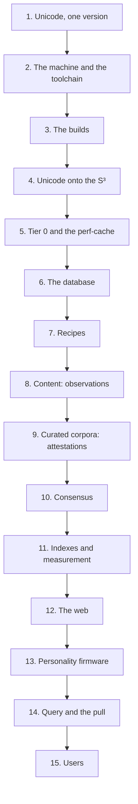

# Sequence

Laplace is built in one order, and each stage is impossible without the one before it: Unicode onto the S³, tier 0, the perf-cache, the store, content, attestations, consensus, the firmware, the pull, and only then a user.

This page is the chain, from start to finish. It adds nothing to the specification: every stage points at the page that specifies it. Where a page is silent, the stage says so and stays silent too.

## 1. Unicode, one version

Everything in Laplace is Unicode content, so the first thing fixed is which Unicode. Tier 0 is built from the Unicode data in full: the UCD XML, `allkeys.txt` from the UCA, the bidi, CJK, and emoji data, and the ISO and other flags that go with them. Tier 0 and segmentation always use the same Unicode version, and a new version is adopted only when its data and its segmentation tooling are both final.

- Needs: the Unicode data files and the segmentation tooling, at one version.
- Gives: the codespace, all 1,114,112 codepoints, and the order and properties every later stage reads.
- Without it: there is no codespace to place, no order to place it in, and no segmentation to break content with.
- Specified in [Atoms: Unicode data](Storage/Atoms.md#unicode-data), [Atoms: Unicode versions](Storage/Atoms.md#unicode-versions), and [Compositions: Segmentation](Storage/Compositions.md#segmentation).

## 2. The machine and the toolchain

Laplace runs on x86-64 CPUs, uses every SIMD level the CPU has, never requires a GPU, and wants its database heap, write-ahead log, and temporary files on separate fast drives. Every build uses Intel oneAPI. All repositories, Laplace's and its dependencies' alike, live under one source root, with build trees kept outside it. The dependencies are cloned and built from source with `icx`, with the compiler flags, arguments, and math libraries that give the same bits on every CPU, operating system, and linker: PostgreSQL, PostGIS, GEOS, PROJ, GDAL, BLAKE3, CORE-MATH, Eigen 3.4, Spectra, hnswlib, tree-sitter, and ICU.

- Needs: the hardware, the drives, oneAPI, and the dependency sources.
- Gives: one toolchain and one environment file that every Laplace build reads.
- Without it: nothing compiles, and anything that compiles elsewhere does not agree bit for bit.
- Specified in [Setup](Operations/Setup.md), [Architecture: Native C](Architecture.md#native-c), and [Research: Numerics](Research/Numerics.md#deterministic-builds).

## 3. The builds

PostgreSQL is built with `icx` so that the server and the extensions share one compiler. Laplace-Native is the library with the shared code. Laplace-postgres is the expansion of PostgreSQL to 4D, with real math from Laplace-Native, installed into PostgreSQL's directories. Laplace-Engine is Laplace itself. Every build has a fingerprint. The `icx` and `gcc` builds must agree on every golden value, such as the tier-0 IDs and Hilbert values, bit for bit.

- Needs: stage 2.
- Gives: the server, the library, the extension, and the engine, each fingerprinted.
- Without it: there is no generator for tier 0, no 4D functions in the database, and no engine.
- Specified in [Builds](Operations/Builds.md) and [Architecture: Repositories](Architecture.md#repositories).

## 4. Unicode onto the S³

Laplace places everything in a 4-ball inside a 4-cube, with Unicode projected across the 4-ball's surface, the S³. The codepoints are sequenced by DUCET. The points are Marc Alexa's Super-Fibonacci points, taken in the order of their Hilbert value from the 4-cube, filtered to the S³. DUCET rank *r* takes the *r*-th point, so collation neighbors are spatial neighbors. That projection is the perimeter: the wall nothing can fall outside of.

- Needs: stage 1 for the order, stage 3 for the deterministic arithmetic.
- Gives: one coordinate on the S³ for every codepoint, the same on every install with the same fingerprint.
- Without it: there is no surface, no wall, and no place for a composition to fall inward from.
- Specified in [Space](Storage/Space.md), [Atoms: Placement](Storage/Atoms.md#placement), [Research: Placement](Research/Placement.md), and [Research: Sampling](Research/Sampling.md).

## 5. Tier 0 and the perf-cache

Codepoints are tier 0, the absolute floor: every Unicode codepoint has a deterministic ID and a deterministic coordinate on the S³. A codepoint's ID is the BLAKE3 hash of its UTF-8 bytes. Tier 0 is generated native C that is marshalled into PostgreSQL and memory-mapped as a perf-cache, so the client can look up any codepoint in O(1). Tier 0 is still recorded to the database, but function calls never need to read it from there. Every build has a checksum, a fingerprint, so an install knows which tier 0 it has.

- Needs: stage 4.
- Gives: the ID, coordinate, and Hilbert value of every codepoint, in a file the client and the database both map.
- Without it: nothing above tier 0 can have an ID or a coordinate, because every composition's ID is hashed from its constituents' IDs and every coordinate is computed up from the codepoint leaves. The client can compute nothing.
- Specified in [Atoms](Storage/Atoms.md), [Identity: BLAKE3](Storage/Identity.md#blake3), and [Identity: Client-side computation](Storage/Identity.md#client-side-computation).

## 6. The database

PostgreSQL's defaults suit small general-purpose servers; Laplace tunes memory, I/O, and planning to its hardware and to the way it uses geometry and indexes. A Laplace database then goes from empty to loaded in order: role, database, and extensions; the extension pointed at the tier-0 perf-cache; the content schema, with entities, paths, and statistics list-partitioned by tier and the largest tiers split again by the ID hash. The Laplace content database holds entities, physicalities, and sources; operational data stays conventional, in a separate database.

- Needs: stage 3 for the server and the extension, stage 5 for the tier 0 the extension maps.
- Gives: somewhere to record an entity and its physicality, and a database that can compute IDs and coordinates in place.
- Without it: there is nowhere to record a composition, and no index for a lookup to hit.
- Specified in [Database](Operations/Database.md), [Deployment](Operations/Deployment.md), [Architecture: Databases](Architecture.md#databases), [Physicality: Partitions](Storage/Physicality.md#partitions), and [Query: Functions in queries](Query.md#functions-in-queries).

## 7. Recipes

Literally any standardized or fixed-format file is a modality to Laplace, and Laplace treats them all exactly the same: a generic decomposer uses a recipe to tell it how to extract the content. Recipes denote how content is recorded, what content is recorded, what gets reproducibility, and what does not matter. Plain text breaks down by UAX #29; every other format needs its recipe before a file of it can be ingested.

- Needs: stage 1 for the segmentation, and the format's own specification.
- Gives: the decomposition of one kind of file into a Merkle DAG, and its recomposition byte for byte.
- Without it: a file of that format is a random binary blob, and nothing in it is content.
- Specified in [Ingestion: Recipes](Storage/Ingestion.md#recipes), [Compositions: Files](Storage/Compositions.md#files), and [Research: Recipes](Research/Recipes.md).

## 8. Content: observations

The client breaks content down and computes its IDs and coordinates itself, using the memory-mapped tier 0. A composition is an n-ary, recursive sequence of constituents; its ID is the BLAKE3 hash of its constituents, and its real coordinate is the average of theirs, so it falls inward. Its content is stored as a trajectory. Deduplication is an O(tier) check from trunk to leaf, and same content means the same hash, so ingesting the same Merkle DAG again lands on the same nodes. Normal digital content gives observations: the physicality trajectory alone gives precedes, contains, co-occurrences, and more.

- Needs: stages 5, 6, and 7.
- Gives: entities, physicalities, and sources, and every observation the trajectory carries.
- Without it: there is nothing for a witness to attest to, because entities get the attestations.
- Specified in [Compositions](Storage/Compositions.md), [Identity](Storage/Identity.md), [Physicality](Storage/Physicality.md), [Ingestion](Storage/Ingestion.md), and [Attestations: Observations](Semantics/Attestations.md#observations).

## 9. Curated corpora: attestations

Curated corpora give attestations, observations, witnessing, usage, examples, and more. A claim is a tuple of entities with referential integrity: every part of a claim is an entity, so the entities a claim names are recorded before the claim. Attestations are recorded at the highest tier possible for a given corpus. Entities are witnessed; a witness derived from another witness records that lineage, so copies do not count as independent consensus. Laplace does not record every pair of translations: a word has an ILI, so the identifiers that other corpora bubble up to are recorded before the corpora that bubble up to them.

Dozens of corpora are required. Which corpus comes in which position, and at what priority, is the inventor's list; this page states only the rule the list obeys.

- Needs: stage 8, and for each corpus the entities and identifiers its claims refer to.
- Gives: witnesses, claims, and attestations: wins, draws, losses, and scores.
- Without it: there are no semantics, no way to link concepts and languages, and nothing for a strand to tug back with.
- Specified in [Attestations](Semantics/Attestations.md), [Claims](Semantics/Claims.md), and [Semantics](Semantics/README.md).

## 10. Consensus

Everything attested about a claim, as a whole, provides its overall score: a Glicko-2 standing. There are no rating periods. As content is observed, first in, first out, the matchups are played, so the order the corpora arrive in is part of the record. A witness or claim entering for the first time starts from a stock default for its level of attestation and the source's trust. Trust runs from MANDATE, 1.0, down through mathematical results, academically curated datasets, user-curated corpora, user prompts, and social media posts. There are no consensus folds and no ETL.

- Needs: stage 9, and the trust and entry defaults set before the first matchup is played.
- Gives: a standing on every claim that tells how hard it tugs back.
- Without it: attestations are a ledger with no score, and a pull has nothing to order strands by.
- Specified in [Consensus](Semantics/Consensus.md).

## 11. Indexes and measurement

After a bulk load come the indexes: B-tree on IDs and Hilbert values, 4D GiST on real coordinates, GIN on the IDs decoded from paths, which finds containers, and a B-tree on occurrences. Then measurement. Development favors observability and benchmarks over a heavy focus on tests and gates: every native operation is measured, and every query is run cold and warm.

- Needs: stages 8 to 10 loaded.
- Gives: O(log N) lookups, and the numbers that say whether this install is the one the specification measured.
- Without it: every lookup is a scan, and no step of the forward pass is O(log N) + O(K).
- Specified in [Deployment](Operations/Deployment.md), [Physicality: Indexes](Storage/Physicality.md#indexes), [Database: Planning](Operations/Database.md#planning), and [Research: Engine Measurements](Research/Engine.md).

## 12. The web

When entities and physicalities are recorded, additional records and relations are added to form a spider colony web: N spiders, all with interwoven webs, where pulling on one strand makes everything else tug back. Consensus tells how hard it tugs back. Degrees of separation measure how far anything is from anything else. From any entity, Laplace can hop and fan out to anything else with integrity.

- Needs: stages 10 and 11.
- Gives: hop and fanout from anything to anything.
- Without it: an entity is a record with a standing and no neighbors.
- Specified in [Pull: The web](Semantics/Pull.md#the-web) and [Pull: Hop and fanout](Semantics/Pull.md#hop-and-fanout).

## 13. Personality firmware

The knowledge is the training data: the records of entities, physicalities, claims, attestations, and standings. Governance, control, limitations, restrictions, and behavior are the firmware. They stay isolated from that knowledge so they do not contaminate it. The firmware is a pull's decision tree: which segment of which branch to take, and how to combine them. Its form is instruction sets. The engine does not modify it.

- Needs: nothing in the records; it is kept out of them on purpose.
- Gives: one way through the records, for one human being.
- Without it: no pull can choose, so no pull can run.
- Specified in [Personality firmware](Semantics/Firmware.md) and [Pull: The choice](Semantics/Pull.md#the-choice).

## 14. Query and the pull

Laplace finds content by computing its ID and coordinates on the client and looking them up with spatial indexes: lookup by ID, every container through GIN, gaps, shape. The forward pass is native C recursive operations with A* and indexed lookups, pulling on the interwoven web under the firmware. There is no softmax and no context window.

- Needs: stages 11, 12, and 13.
- Gives: an answer: a set, a segment of a branch, a combination, or a single fact when a high-trust witness curated it.
- Without it: nothing answers.
- Specified in [Query](Query.md) and [Pull](Semantics/Pull.md).

## 15. Users

A prompt is ingested as text, broken down, given a trunk node ID, and processed through the forward pass. What users upload during normal usage does not give attestations; it gives observations. A user prompt enters at user-prompt trust, and Laplace's own prompts are lower trust than user prompts, by design. Users have an operating language, while Laplace can speak any; language is a filter on the claims, applied when querying. Each user's pull runs under that human being's firmware.

- Needs: stage 14.
- Gives: the first use of Laplace.
- Without everything before it: there is nothing to prompt.
- Specified in [Pull: The forward pass](Semantics/Pull.md#the-forward-pass), [Consensus: Trust](Semantics/Consensus.md#trust), [Attestations: Observations](Semantics/Attestations.md#observations), and [Semantics](Semantics/README.md).

## After the chain

These need the whole chain and add to it; none of them is a stage of it.

- **AI models as sources.** AI models rank above user prompts, around user-curated sources, and below academically curated datasets: still curated content, but the opinions of others. See [Consensus: Trust](Semantics/Consensus.md#trust) and [Research: Model Ingestion](Research/Models.md).
- **Other modalities.** Images, audio, code, and every other standardized file, each through its recipe, stage 7 again for each format. See [Compositions: Segmentation](Storage/Compositions.md#segmentation) and [Research: Recipes](Research/Recipes.md).
- **Laplace's own attestations.** When Laplace can code, and it compiles something that fails, that failure is an attestation: Laplace just trained itself. See [Attestations: Outcomes](Semantics/Attestations.md#outcomes).
- **A new Unicode version.** The codespace will not change for a very long time. A new version changes only the points, so stages 4 and 5 run again, and only once its data and segmentation tooling are both final. See [Atoms: Unicode versions](Storage/Atoms.md#unicode-versions).

## Running it again

Because IDs are deterministic, ingesting the same Merkle DAG again lands on the same nodes: it is the same content, so it overlaps, and nothing is recorded twice. Two installs with the same tier-0 fingerprint produce the same coordinates for the same content, so they sync perfectly. See [Identity: Same content, same hash](Storage/Identity.md#same-content-same-hash) and [Atoms: Generation](Storage/Atoms.md#generation).
