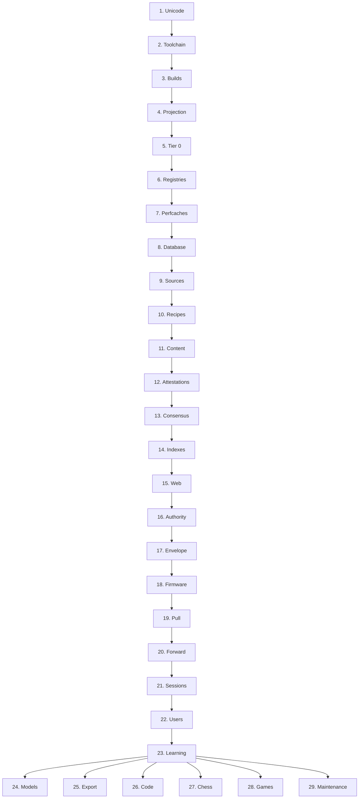

# Sequence

Laplace is built in one order, and each stage is impossible without the one before it: Unicode onto the S³, tier 0, the registries and perf-caches, the store, sources through recipes into content, attestations, consensus, indexes, the web, authority, the compute envelope, the firmware, the forward program, sessions, and only then a user, whose consequences feed the learning loop that models, export, code, chess, and games all run on.

Each stage is its own page, and each page is the operations of that stage in the order they run: what each operation takes in, what it does, what it writes, and what checks it. A stage's first operation needs the last operation of the stage before it. The specification pages of this wiki and the invention documents of the monorepo (`docs/INVENTION.md`, `docs/INVENTIONS.md`, `docs/CAPABILITIES.md`, and the binding specs 05, 06, 08, 09, 11, 12, 33, 34, 36, 37, 38, 39) are the authority; these pages repeat them operation by operation so that the order itself is recorded, and link to the page each operation comes from. Where the two authorities disagree, the disagreement is recorded in [30. Conflicts](Conflicts.md) and not resolved here.

- [1. Unicode](Unicode.md): one version, every file.
- [2. Toolchain](Toolchain.md): the machine and every dependency, built the same way.
- [3. Builds](Builds.md): the server, the library, the extension, the engine, one deployed revision.
- [4. Projection](Projection.md): every codepoint onto the S³.
- [5. Tier 0](Tier-0.md): the anchor perf-cache and its fingerprint.
- [6. Registries](Registries.md): relations, qualifiers, trust classes, entity types, vocabularies, firmware policy kinds: governed, append-only, bit-stable.
- [7. Perfcaches](Perfcaches.md): the derived ROM lattice above tier 0.
- [8. Database](Database.md): the tuned server and the four families of durable state.
- [9. Sources](Sources.md): a source generation: authority, release, artifact graph, provider, recipe, activated together.
- [10. Recipes](Recipes.md): one format decomposer per format, one semantic recipe per source.
- [11. Content](Content.md): the ingest spine, from unpack to fold completion.
- [12. Attestations](Attestations.md): witnesses, typed claims, qualifiers, collections, record versus calculate.
- [13. Consensus](Consensus.md): one matchup per attestation, at the witness's trust.
- [14. Indexes](Indexes.md): after the bulk load, then measurement.
- [15. Web](Web.md): the spider-colony web and its typed channels.
- [16. Authority](Authority.md): knowledge, authority, and compute as three axes; packages and capabilities.
- [17. Envelope](Envelope.md): hops, fanout, and work: plan, reserve, execute, receipt, reconcile.
- [18. Firmware](Firmware.md): the program over the instruction set, kept out of the records.
- [19. Pull](Pull.md): the lookups and operators a stage of the program calls.
- [20. Forward](Forward.md): RESOLVE, COUPLE, ORIENT, ROUTE, SCAN, COMPOSE, PROPOSE, STEER, SELECT, REALIZE, WITNESS.
- [21. Sessions](Sessions.md): tenant, user, session, turn, and the surfaces that bind the one program.
- [22. Users](Users.md): the first prompt.
- [23. Learning](Learning.md): OODA, the three rates, the feedback lanes, and the Gödel lane.
- [24. Models](Models.md): a checkpoint as a witness.
- [25. Export](Export.md): Mold-a-Model.
- [26. Code](Code.md): software as structural construction.
- [27. Chess](Chess.md): the proving domain.
- [28. Games](Games.md): the Knowledge Arena.
- [29. Maintenance](Maintenance.md): forget, sweep, reseed, regenerate, upgrade.
- [30. Conflicts](Conflicts.md): what the two authorities say differently, recorded and unresolved.

## What comes after the chain

Stages 24 to 29 need the whole chain and add to it. They are not stages of the chain; each is a lane that runs through [20. Forward](Forward.md) and [23. Learning](Learning.md) again. A new Unicode version runs [1. Unicode](Unicode.md) through [5. Tier 0](Tier-0.md) again with a new fingerprint, under the rules of [29. Maintenance](Maintenance.md).
