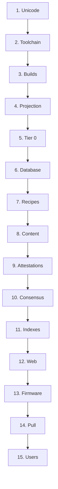

# Sequence

Laplace is built in one order, and each stage is impossible without the one before it: Unicode onto the S³, tier 0, the perf-cache, the store, content, attestations, consensus, the firmware, the pull, and only then a user.

Each stage is its own page, and each page is the operations of that stage in the order they run: what each operation takes in, what it does, what it writes, and what checks it. A stage's first operation needs the last operation of the stage before it. The specification pages are the authority; these pages repeat them operation by operation so that the order itself is recorded, and link to the page each operation comes from.

- [1. Unicode](Unicode.md): one version, every file.
- [2. Toolchain](Toolchain.md): the machine and every dependency, built the same way.
- [3. Builds](Builds.md): the server, the library, the extension, the engine.
- [4. Projection](Projection.md): every codepoint onto the S³.
- [5. Tier 0](Tier-0.md): the perf-cache and its fingerprint.
- [6. Database](Database.md): the tuned server and the schema.
- [7. Recipes](Recipes.md): one per format, before any file of it.
- [8. Content](Content.md): observations.
- [9. Attestations](Attestations.md): curated corpora, in order.
- [10. Consensus](Consensus.md): one matchup per attestation.
- [11. Indexes](Indexes.md): after the bulk load, then measurement.
- [12. Web](Web.md): standings read as confidence and cost.
- [13. Firmware](Firmware.md): the decisions, kept out of the records.
- [14. Pull](Pull.md): lookups and the forward pass.
- [15. Users](Users.md): the first prompt.

## What comes after the chain

These need the whole chain and add to it; none is a stage of it.

- AI models as sources: their files through recipes as content, their embeddings as witnessed testimony at the model's trust. See [Consensus: Trust](../Semantics/Consensus.md#trust) and [Research: Model Ingestion](../Research/Models.md).
- Other modalities: images, audio, code, games, each through its recipe, [7. Recipes](Recipes.md) again for each format.
- Laplace's own attestations: when Laplace can code, and it compiles something that fails, that failure is an attestation. See [Attestations: Outcomes](../Semantics/Attestations.md#outcomes).
- A new Unicode version: only the points move, so [4. Projection](Projection.md) and [5. Tier 0](Tier-0.md) run again with a new fingerprint, and only once the data and the segmentation tooling are both final. See [Atoms: Unicode versions](../Storage/Atoms.md#unicode-versions).
